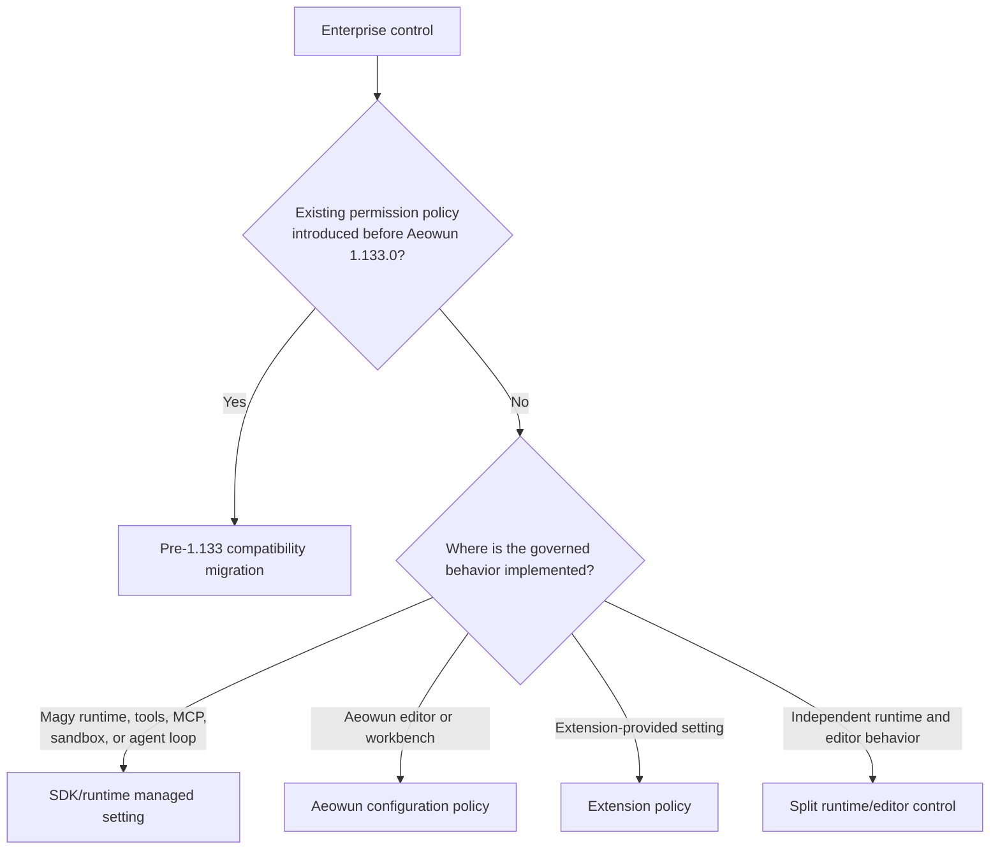

# Adding an Enterprise Policy

Choose the policy destination by **where the governed behavior is implemented**. Most controls for Magy agent behavior belong in the SDK/runtime rather than the Aeowun workbench.

Follow the matching guide:

- [SDK/runtime managed setting](./sdk-runtime-policy.md)
- [Aeowun configuration policy](./aeowun-policy.md)
- [Extension-provided setting](./extension-policy.md)
- [Split runtime/editor control](./mixed-policy.md)
- [Pre-1.133 permission-policy migration](./legacy-permission-policy.md)

General rules:

- Runtime enforcement is authoritative for behavior executed inside the runtime.
- Do not duplicate a runtime parser, matcher, or security decision in Aeowun.
- An Aeowun policy is appropriate only for editor/workbench-owned behavior.
- New Magy enterprise controls should target the shared managed-settings/SDK model.
- The Aeowun settings-to-managed-settings bridge is a compatibility path for legacy settings only.
- Run `npm run export-policy-data` for every Aeowun or extension policy change. Never edit `build/lib/policies/policyData.jsonc` manually.

## Deprecated and Historical Channels

Some policy channels remain supported for existing controls but are closed to new properties:

- **Account policy data** is deprecated for new controls. Existing fields remain for compatibility.
- New Magy enterprise controls use managed settings and runtime/SDK enforcement.

Supporting references:

- [Magy managed settings](./magy-managed-settings.md)
- [Local policy testing](./local-testing.md)

Trust executable source and tests over planning documents.
